# SAE 302 Dev. applications (Chasse au monstre)
## Membre du groupe
Voici les membres de notre groupe :
- Samy Van Calster
- Valentin Hebert
- Lisa Haye
- Abdallah Toumji

## Sommaire

- Diagramme
- Scénario du jeu


## Diagramme

```mermaid
classDiagram

    Maze <-- "1 board" Game
    ICellEvent<|..Cell
    IHunterStrategy <-- "1 hunter" Game
    IMonsterStrategy <-- "1 monster" Game
    IStrategy <-- IMonsterStrategy
    IStrategy <-- IHunterStrategy
    ICoordinate <|.. Coordinate
    ICellEvent <|.. Cellinfo
    IHunterStrategy<|..HumanHunterStrategy
    IMonsterStrategy<|..HumanMonsterStrategy
    Maze <-- "1 maze" View
    ICoordinate <-- "1 coordonate" View
    Game <-- "1 observable" View
    Cellinfo <-- "1 turn" View
    View <-- "1 observer" Game
    Game <-- "1observer" HumanHunterStrategy
    ICellEvent <-- "1 choice" HumanHunterStrategy
    Game <-- "1observer" HumanMonsterStrategy
    ICellEvent <-- "1 choice" HumanMonsterStrategy
    Cellinfo <-- "1 state" Cell
    ICoordinate <-- "1 coordonate" Cell
    ICoordinate <-- "1 hunterCo" Maze
    ICoordinate <-- "1 monterCo" Maze
    ICoordinate <-- "1 exitCo" Maze
    ICoordinate <-- "* monsterMoves" Maze
    ICoordinate <-- "* hunterShots" Maze
    ICellEvent <-- "* hunterView" Maze
    ICoordinate <-- "1 DEFAULT_MONSTER_COORDINATE" Maze
    ICoordinate <-- "1 DEFAULT_HUNTER_COORDINATE" Maze
    ICoordinate <-- "1 DEFAULT_EXIT_COORDINATE" Maze
    ICellEvent <-- "* cells" Plateau
    Coordinate <-- "1 coordinate" MazeCellPane
    

    class Maze{
    -monsterView : boolean[][]

    +copyOf(Maze maze) Maze
    +displayMaze() void
    +createPath(ICoordinate monsterCell, ICoordinate exitCell) List<ICoordinate>
    +shortPathCellFor(ICoordinate start, ICoordinate end) ICoordinate
    +copyCellsOf(Maze maze) ICellEvent[][]
    +update(ICellEvent arg0) void
    +isValidShot(ICoordinate shot) boolean
    +isValidMovement(ICoordinate movement) boolean
    +main(String[] arg0) void
    }


    class Cell{
    -turn : int
    -DEFAULT_TURN_CELL : int

    +getCoord() ICoordinate
    +toString() String
    +hashCode() int
    +equals(Object obj) boolean
    }


    class Game {
        -isMonsterTrun : boolean
        -turn : int
        -history : String

        +playTurn(player : IStrategy) void
        +start() void
        +addToHistory(ICoordinate action) void
        +initialize() void
        +swapTurn() void
        +update(ICellEvent arg0) void
        +updateHunter(ICellEvent arg0) void
        +attach(View obs) void
        +notifyAllViews() void
        +detach() void
        +isMonsterTurn() boolean
        +displayHunterView() void
        +displayMonsterView() void
        +changeHunterView(ICoordinate coord) void
        +updateMonster(ICellEvent choice) void
    }


    class Coordinate {
        -row : int
        -col : int
        
        +hashCode() int
        +equals(Object obj) boolean
        +equals(Coordinate coordinate) boolean
        +toString() String
    }


    class IStrategy {
            <<interface>>
        +play() ICoordinate
        +update(event CellEvent)
    }


    class IMonsterStrategy {
            <<interface>>
        +innitialize(maze : boolean[][])
    }


    class IHunterStrategy {
            <<interface>>
        +innitialize(nbRows : int, nbCols : int)
    }


    class ICoordinate {
            <<interface>>
        +getRow() int
        +getCol() int
    }
    

    class ICellEvent {
            <<interface>>
        +getState() Cellinfo
        +getTurn() int
        +getCoord() ICoordinate
    }


    class Cellinfo {
            <<enumeration>>
        EMPTY
        WALL
        MONSTER
        HUNTER
        EXIT
    }


    class HumanHunterStrategy{
        -ISBOT:boolean

        +initialize(int rows, int cols) void
        +play() ICoordinate
        +update(ICellEvent iCellEvent) void
        +attach(Game obs) void
        +detach() void
        +isISBOT() boolean
    }


    class HumanMonsterStrategy{
        -ISBOT:boolean

        +initialize(boolean[][] arg0) void
        +play() ICoordinate
        +update(ICellEvent iCellEvent) void
        +attach(Game obs) void
        +detach() void
        +isISBOT() boolean
    }
    

    class View{
        +start(Stage primaryStage) start
        +main(String[] args) void
        +mainMenu() void
        -debugMenu() void
        -hostMenu() void 
        +viewReset() void 
        +gameStart() void
        +displayMonsterView(boolean[][] view) void
        +displayHunterView(ICellEvent[][] view) void
        +titleLabel(String title) Label
        +createIndexLabel(int number) Label
        +createIndexLabel(char lettre) Label
        +update() void
    }


    class Plateau{
        #wallProbabilitie : double
        -rand : Random
        #DEFAULT_ROW : int
        #DEFAULT_COL : int

        +replace(List<ICoordinate> coordinates, CellInfo before, CellInfo after) void
        +swap(ICoordinate coordinate1, ICoordinate coordinate2) boolean
        +equals(ICoordinate coordinate1, ICoordinate coordinate2) boolean
        +incrementTurn(HashMap<ICoordinate, ICellEvent> list) HashMap<ICoordinate, ICellEvent>
        +isInMaze(ICoordinate coordinate) boolean
        +isInMaze(ICoordinate... coordinate) boolean
        +isInMaze(int line , int column) boolean
        +isPathPossible(ICoordinate start, ICoordinate end) boolean
        +isPathPossible(int startLine, int startColumn, int endLine, int endColumn) boolean
        +isPathPossibleDFS(int currentLine, int currentColumn, int endLine, int endColumn, boolean[][] visited) boolean
        +createArea(double propabilitie) void
    }


    class MazeCellPane{
        -CELL_SIZE : double
        -cellRectangle : Rectangle
    }
```


## Scénario du jeu

```text
Gandalf : Voici l’Anneau Unique, forgé par Sauron, le seigneur des ténèbres, dans les flammes de la Montagne du Destin. Le mal gronde en Mordor. L’anneau s’est réveillé. Il a entendu son maître l’appeler.

Frodon : Mais il a été détruit, Sauron a été détruit !

Gandalf : Non Frodon, l’esprit de Sauron a subsisté. Sa force vitale est liée à l’Anneau et l’Anneau a survécu. Sauron est de retour, ses orques se sont multipliés, sa forteresse de Barad-Dür a été reconstruite. Avec cet Anneau, il couvrira les terres de ténèbres. Il le cherche, toutes ses pensées sont fixées sur lui. Car l’Anneau désire par-dessus tout retrouver la main de son maître. Ils ne font qu’un, l’Anneau et le seigneur des ténèbres. Frodon… Il ne doit jamais le trouver

Frodon : Entendu ! Mettons-le de côté, cachons-le et ne parlons plus jamais de lui. Personne ne sait qu’il est là ? N’est-ce pas ?

Gandalf : Un autre savait que Bilbon avait l’Anneau. J’ai cherché Gollum partout mais l’ennemi l’a trouvé avant moi. J’ignore qu’elles tortures il a enduré, mais parmi les cris et les plaintes, ils ont perçu deux mots… La Comté ! Sacquet !

– Sauron fait son apparition –

Sauron : Je vous ai enfin trouvé ! Donnez-moi l’Anneau et vous aurez le droit à une mort rapide.

Gandalf : Vous devez partir et vite ! Quittez la Comté, allez à Bree, passez par le labyrinthe c’est le meilleur moyen de le semer. Je reste ici pour retenir Sauron.

Frodon : Mais… Et vous ?

Gandalf : Le plus important c’est de mettre l’Anneau en sécurité et c’est à vous qu’incombe cette tâche, pas à moi. Partez, vite !

Frodon : Entendu.

– Frodon part en courant vers le labyrinthe –

Sauron : Vous croyez vraiment que je vais le laisser partir aussi facilement ?

– Sauron essaie de rattraper Frodon mais Gandalf lui barre le passage –

Gandalf : VOUS NE PASSEREZ PAS !

– Sauron bat Gandalf et se lance à la poursuite de Frodon dans le labyrinthe –
```